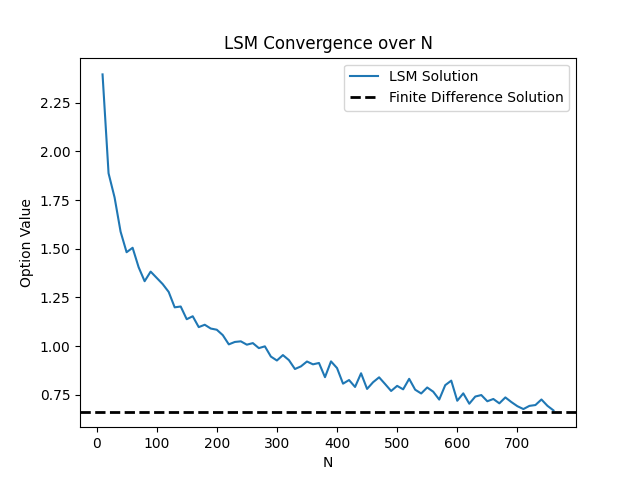

# Least-Squares Monte Carlo Options Pricing Algorithm
## Overview
For this project, I:
* 

**About me:** I am a Physics & Applied Mathematics major at the University of Notre Dame. I have extensive experience in data analytics, mathematical modeling, and machine learning throughout experimental nuclear physics, an NSF undergraduate research fellowship, and a quantitative finance internship. If you would like to get in touch, please reach out via email at [tgore@nd.edu](mailto:tgore@nd.edu).

## Introduction
### Finite Differencing
Determining the fair value of an option is a central problem throughout trading. Various analytical and numerical methods exist in the options pricing realm. 

If we choose to model options using a low-dimensional (few factor) model, the *finite difference* method of option pricing can prove useful. Here, we approximate the model's partial derivative terms as small finite differences in the dependent variable $y$ divided by the independent variable $x$. For first-order derivatives, assuming a sufficiently small step size $h$, this looks like:
$$
\begin{aligned}
    \frac{\partial y}{\partial x} &\approx \frac{y(x+h) - y(x)}{h}
\end{aligned}
$$

When evaluating such an equation computationally, we take some small but finite $h$ and compute the partial derivative across a discrete grid of points. For first-order derivatives and one-dimensional problems, this appears to be a simple task and can be numerically evaluated very easily. In higher dimensions, however, where we have many independent variables $x_n$ affecting our option value $V$, iterating over this grid becomes prohibitively expensive. Given that an option's price is clearly driven by many variables, a technique for pricing options in high-dimensional spaces is required.

### Least-Squares Monte Carlo
In 2001, Francis Longstaff and Eduardo Schwartz introduced the *least-squares Monte Carlo* (LSM) approach to option pricing. Instead of discretizing a partial differential equation, LSM uses $N$ asset price paths simulated using a stochastic model to estimate the option's optimal exercise points. In general, we should exercise an option if its exercise value, the value of exercising the option at the current time step, is greater than its continuation value, the value of exercising the option in the future.

To optimally exercise the option along each price path, we must be able to estimate the value of exercising the option in the future and compare it to the value of exercising the option in the present. Let $\mathbf{X}$ represent the matrix of simulated future price paths. Each of $M$ rows represents an individual pricepath, and each of $N$ columns represents an individual time step. To estimate the continuation value of the option, we will first regress the exercise value one step in the future $Y_{t+1}$ on some basis expansion of the current simulated stock price $f(X_t)$.
$$
\begin{aligned}
    Y_{t+1} &= f(X_t) + \text{bias}
\end{aligned}
$$

Note that both $Y_{t+1}$ and $X_t$ are vectors representing columns of exercise values and stock prices (and other stochastically modeled terms, like interest rates or volatility) at $t+1$ and $t$, respectively, across all $M$ simulated price paths. The regression itself can be performed using various methods, from simple linear regression to random forests. The regression's prediction $\hat{Y}_t$ is used to estimate the continuation value of the option at every step. The reason we bother regressing at all is because, if we merely used the exercise values computed via the true price at the next time step $X_{t+1}$, we would expose ourselves to a lookahead bias by conditioning on *future randomness*, and we would fail to capture the noise inherent in option valuation. By regressing at each step, we are predicting the continuation value conditional on *past information*, which is much more reasonable. Moreover, since we are computing an expectation across many paths, we filter out the noise from future randomness and therefore obtain a reasonable estimate for the option's value.

To optimally exercise the option along each path, we exercise at the earliest point when the immediate exercise value is greater than the regression-estimated continuation value. Following this rule, we can average over the discounted cash flows of optimally exercising the option along different time steps and then sum over all time steps. The value we obtain from this procedure is the LSM-estimated value of the option.

## Implementation
To ensure a robust understanding of the underlying mathematical and computational processes making LSM possible, I used only NumPy in my implementation, implementing all forms of regression, basis expansions, finite difference methods, and LSM itself using only NumPy arrays. NumPy is a powerful vectorized scientific computing package, and given the size of the asset price arrays that can be encountered here, its performance is extremely useful.

### LSM Computation
The process of LSM involves computing a regression at each of $N$ time steps. This process would ordinarily prove prohibitively slow, especially when $N$ is very large. Luckily, we can use multithreading to execute multiple regressions (nearly, by the GIL) at the same time. Threads have access to the same memory, so they can all write to the final continuation value array in parallel, resulting in immense time savings.

### Optimal Basis Expansion Degree Selection
A major problem that can be encountered in LSM usage is which basis expansion and what degree of that basis expansion to use. While it may seem intuitive to use a complicated basis with a large degree, this can have unintended side effects. Firstly, using a large basis degree involves making the computations required to compute each feature of that expansion at *every time step*. Obviously, if you have many time steps $N$, this becomes infeasible. Another issue comes from the resulting fit itself. While the estimation will be extremely nonlinear and perhaps can better capture the dynamics of the continuation value across the different time steps, the bias-variance tradeoff must be kept in mind; the fit will likely exhibit extreme variance that is hyperdependent on the number of paths used and the number of time steps, converging to the wrong solution. It is therefore advantageous to device an algorithm that can estimate an appropriate basis expansion degree to avoid these problems.

Our overall objective is to minimize the number of paths $M$ required for LSM to converge. A smaller $M$ means that we don't need to simulate as many paths at the start of LSM, which immediately reduces the computational and temporal overhead of this process. We want to find the simplest basis expansion for which the number of paths required for convergence stops increasing. In the function `estimate_optimal_basis_degree`, the user provides a basis expansion function and a range of basis expansion degrees over which to iterate. The function then, for each basis expansion degree, estimates the $M$ for which the LSM estimate at the given basis expansion converges. The pairs of the minimal convergent $M$ for expansion degree and the degrees themselves are then returned.

An interesting nuance that can be encountered here is that, beyond some critical basis expansion degree, the number of paths required for convergence stops changing, so there is no longer any reason to add any more degrees to the basis expansion. Doing so would needlessly increase computational cost. Thus, we select smallest basis degree where $M$ stops changing.

### Optimal Number of Time Steps
Generally, as the number of time steps $N$ increases, time becomes less discrete and more continuous, and the option value estimated by LSM approaches the finite difference solution. Since we must perform a regression for all $N$, it is within our interest to select some optimal $N$ that converges to the finite difference solution but doesn't needlessly add resolution to an estimate that already converges in continuous time. Additionally, adding too many time steps can vastly increase the variance of the estimate, providing incorrect estimates of the option's value.

The function `estimate_optimal_time_steps` achieves this purpose. For a given basis expansion, basis expansion degree, and number of paths, the function iterates over a user-defined range of time steps, iterating over the time step range until the smallest $N$ required for convergence is found. Combining this functionality with an optimal basis expansion degree and optimal $M$ selected by `estimate_optimal_basis_degree`, the LSM model can be optimaly tuned to various stochastic models, ensuring proper convergence, proper computational resource use, and a proper balance between bias and variance. 

### Finite Difference Implementations
To provide a baseline for LSM estimates, I wrote two finite difference algorithms. One of such is a Crank-Nicholson method, which is used to solve the Heston PDE. To solve the Heston-Hull-White PDE, instead of directly solving the Crank-Nicholson system, we split each dimension into an individual 1D implicit systems that are much less expensive to solve. This is then given to an alternating direction implicit (ADI) method, which converts each 1D part into a tractable tridiagonal system. For both of these methods, when filling in the grid of option prices $V$, we take the maximum between the exercise value and the continuation value of the option. That is, $V^{(n+1)} = \text{max}(V^{(n+1)}, K - S)$, for strike price $K$ and stock price $S$.

Again, it should be noted that solving systems using a finite difference method becomes computationally infeasible as the dimensions of the problem increase. While the dimensions of the Heston or Heston-Hull-White models are (relatively) small, LSM would be the more computationally feasible way to conduct an option valuation scheme when the dimensions of the problem are large, such as those with many stochastic interest rates. In this project, the finite difference methods are used more as a baseline with which to compare the LSM estimations, so I will not devote further time to them.

### Regression Types
Various types of regression can be used at each time step to estimate the continuation value. The simplest method is to perform a simple linear regression, predicting the next exercise value using the current stock price. We can also use multiple linear regression, applying some basis expansion of the stock price as the features to predict the next exercise value. This is a fast and effective method, and the parameter selection methods discussed earlier can allow for this method to be tuned more effectively. I implemented linear regression, alongside an optimal ridge penalty, completely manually in NumPy.

There are other regression methods that have promising results when used in LSM. One of these is decision tree regression, which I implemented manually in NumPy using the CART algorithm. This is essentially a recursive algorithm that builds each node of the tree by greedily selecting the split in each feature at each node by minimizing the variance resulting from that split. The recursion stops when some maximum depth is reached. I also manually implemented a random forest regressor that uses multiprocessing to build several decision trees in parallel and average their predictions. Both of these methods have promising results. Generally, random forests are good for reducing variance at the cost of some bias when variance is a problem in the LSM estimate.

## Results
### Paper Example
In Longstaff-Schwartz (2001), a simple example is presented that can easily validate the accuracy of this implementation. The example considers a matrix of future price paths $\mathbf{X}$ as follows, with the columns representing each time step, starting with $t=0$ (the present, known value, before the simulated values), and the rows representing each of $M=8$ paths:
$$
\begin{aligned}
    \mathbf{X} = \begin{bmatrix}
    1.00 & 1.09 & 1.08 & 1.34 \\
    1.00 & 1.16 & 1.26 & 1.54 \\
    1.00 & 1.22 & 1.07 & 1.03 \\
    1.00 & 0.93 & 0.97 & 0.92 \\
    1.00 & 1.11 & 1.56 & 1.52 \\
    1.00 & 0.76 & 0.77 & 0.90 \\
    1.00 & 0.92 & 0.84 & 1.01 \\
    1.00 & 0.88 & 1.22 & 1.34
    \end{bmatrix}
\end{aligned}
$$

Consider an American-style put option with a strike $K=1.10$, a risk-free rate of $0.06$, and an expiration date $\tau=1$ year away. Our goal is to find the option value at $t=0$. For this example, we mirror the approach taken by the authors, using a second-degree polynomial expansion of the stock price to predict the next-step exercise value.

After running `estimate_continuation_value` with these parameters, we get a value $V=0.1144$, which exactly equals that predicted by Longstaff-Schwartz (2001). The model therefore valid in its predictions. This analysis can be very easily replicated using the `paper_example()` function.

### Convergence
Another important model validation step is visualizing the convergence from discrete time to continuous time as $N \rightarrow \infty$. This means that the LSM solution, which estimates the continuation value of an option given that we can exercise at $N$ discrete points, converges to the continuous finite-difference solution when the exercise opportunities are continuous, as is the case for American-style options.

In applying the optimal $N$ method described earlier, we can easily visualize the convergence of the LSM solution to the finite-difference (continuous solution) as $N$ increases.

    

We can clearly see that ~$750$ time steps are needed for the LSM to converge to the finite-difference solution. In general, using fewer time steps is advantageous, as it regularizes the fit and reduces variance. This convergence method allows one to select an $N$ value that is both large enough to converge to the continuous case but small enough so that the variance of the LSM fit is not too large.

### Overall Takeaways
Overall, this implementation of the Least-Squares Monte Carlo options pricing algorithm provides a good way to value options in high-dimensional spaces, keeping computational complexity in mind. Developing this project gave me a good excuse to study different stochastic models for stock market variables, like the Heston-Hull-White model. Additionally, I implemented every part of this project (excluding one line in the ADI finite difference solution) using only NumPy, which was a challenge since I had to delve into the mathematical nuances of these different approaches, from the stochastic models informing the LSM fit to the different machine learning methods that can generate LSM estimates. Finally, this project included many good use cases for multiprocessing, as many operations that are typically looped can be executed in parallel much more quickly. 

Please reach out to [tgore@nd.edu](mailto:tgore@nd.edu) if you have any inquiries about this project or would like to set up an interview.

*Disclaimer: this project was constructed solely for academic purposes as a way for me to showcase my knowledge of machine learning and stochastic modeling. No part of this project constitutes financial advice. If you deploy this model live, you assume all risks relating to options trading.*